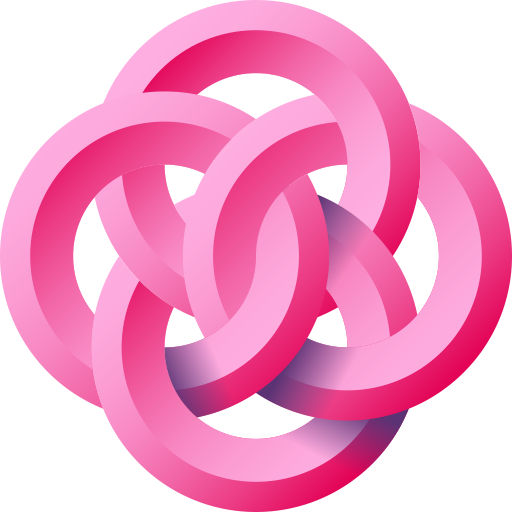

# caian.org

Personal website, blog et cetera.

## Environment

| Variable                | Value     |
| ----------------------- | --------- |
| `AWS_ACCESS_KEY_ID`     | `...`     |
| `AWS_SECRET_ACCESS_KEY` | `...`     |
| `NODE_VERSION`          | `16.13.0` |
| `RUBY_VERSION`          | `2.7.1`   |

## License

To the extent possible under law, [Caian Rais Ertl][me] has waived **all
copyright and related or neighboring rights to this work**. In the spirit of
_freedom of information_, I encourage you to fork, modify, change, share, or do
whatever you like with this project! `^C ^V`

[![License][cc-shield]][cc-url]

[me]: https://github.com/caiertl
[cc-shield]: https://forthebadge.com/images/badges/cc-0.svg
[cc-url]: http://creativecommons.org/publicdomain/zero/1.0
